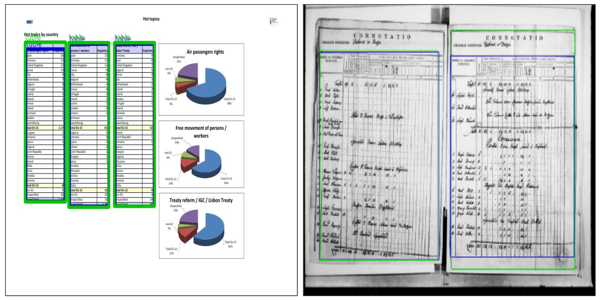

# CDeC-Net
[](https://paperswithcode.com/sota/table-detection-on-icdar2013-1?p=cdec-net-composite-deformable-cascade-network)
[](https://github.com/open-mmlab/mmdetection)


CDeC-Net: Composite Deformable Cascade Network for Table Detection in Document Images

Paper Link:
[ieeexplore](https://ieeexplore.ieee.org/document/9411922) | [arXiv](https://arxiv.org/abs/2008.10831) | [Research Gate](https://www.researchgate.net/publication/343877463_CDeC-Net_Composite_Deformable_Cascade_Network_for_Table_Detection_in_Document_Images) | [CVIT, IIIT-H](http://cvit.iiit.ac.in/usodi/cdec-net.php)


## Introduction
CDeC-Net is an end-to-end network for detecting tables in document images. The network consists of a multistage extension of Mask R-CNN with a dual backbone having deformable convolution for detecting tables varying in scale with high detection accuracy at higher IoU threshold. CDeC-Net achieves state-of-the-art results on various publicly available benchmark datasets.
The code is implemented in PyTorch using <a href="https://github.com/open-mmlab/mmdetection">MMdetection</a> framework (Version 2.0.0). 

## Release Notes:
Oct 10, 2020: Our paper has been accepted to ICPR 2020 as oral paper.

## Setup
<b>Dependencies</b><br>
Python = 3.6+ <br>
PyTorch = 1.4.0<br>
Torchvision =  0.5.0<br>
Cuda = 10.0<br>
MMdetection = 2.0.0<br>
mmcv = 0.5.4<br>

1. Clone this repository
```
git clone https://github.com/mdv3101/CDeCNet
```
2. Install the require dependencies
```
pip install torch==1.4.0 torchvision==0.5.0
```
```
cd CDecNet/
pip install -r requirements/build.txt
pip install "git+https://github.com/open-mmlab/cocoapi.git#subdirectory=pycocotools"
pip install -v -e .
```

Please follow [install.md](docs/install.md) for detailed installation steps.

## Training
1. Create a folder 'dataset' in the CDeCNet and put your data into this folder. Your dataset must be in MS-Coco format. The directory structure should be:
```
dataset
  ├── coco
  | ├── annotations
  | ├── train2014
  | ├── val2014
  | ├── logs
```
2. Create a folder 'model' in the CDeCNet and put the pre-trained model on MS-Coco into this directory. The model file can be downloaded from the [drive](https://iiitaphyd-my.sharepoint.com/:u:/g/personal/madhav_agarwal_research_iiit_ac_in/EUUDgrZoY4ZApFOL7xiiCHMBbSP9ai0OZ-weQ94O2kBQ_A?e=dLFV6I)

3. Set ```load_from= /path/of/pre-trained/model``` in [default_runtime.py](configs/_base_/default_runtime.py)
4. To train a model on CDeC-Net, use the following commnand
```
python -u tools/train.py configs/dcn/db_cascade_mask_rcnn_x101_fpn_dconv_c3-c5_1x_coco.py --work-dir dataset/coco/logs/
```
<br>
Note that step 2 and 3 are optional. If you want to train a model from scratch, then you can skip these two steps. (Training a model from scratch will take larger time to converge)

## Evaluation
To evaluate the trained model, run the following command
```
python tools/test.py configs/dcn/db_cascade_mask_rcnn_x101_fpn_dconv_c3-c5_1x_coco.py dataset/coco/logs/latest.pth \
    --format-only --options "jsonfile_prefix=evaluation_result"
```
Details about various training and evaluation methods can be found in [getting_started.md](docs/getting_started.md)

## Demo
To run inference on single image, use the image_demo.py file by running the following command
```
python demo/image_demo.py demo_image.jpg configs/dcn/db_cascade_mask_rcnn_x101_fpn_dconv_c3-c5_1x_coco.py dataset/coco/logs/latest.pth \
    --score-thr 0.95 --output-img 'output_demo.jpg'
```

## CDeCNet Results
1. Comparison between CDeC-Net and state-of-the-art techniques on the existing benchmark datasets.

| Dataset    | Method                     | Precision            | Recall               | F1                   | mAP                  | Checkpoint |
|------------|----------------------------|----------------------|----------------------|----------------------|----------------------|------------|
|ICDAR-2013  | DeCNT <br>CDeC-Net         | 0.996 <br> **1.000** | 0.996 <br> **1.000** | 0.996 <br> **1.000** | - <br> **1.000**     | <br> [model](https://iiitaphyd-my.sharepoint.com/:u:/g/personal/madhav_agarwal_research_iiit_ac_in/EWZh5EhnvbJIr5B_ZJqeAncBSeCds15vic2dcjA4r7J0AA?e=SDiO6H) |
|ICADR-2017  | Yolov3<br>CDeC-Net         | **0.968** <br> 0.924 | **0.975**<br> 0.970  | **0.971** <br> 0.947 | - <br> **0.912**     | <br> [model](https://iiitaphyd-my.sharepoint.com/:u:/g/personal/madhav_agarwal_research_iiit_ac_in/Eb6UT-yRRdRMoe8fXb7Ry70BnP533QVis-TFjxcy8B6Lng?e=c2YxHI) |
|ICADR -2019 | TableRadar<br>CDeC-Net     | **0.940** <br> 0.934 | 0.950 <br> **0.953** | **0.945** <br> 0.944 | - <br> **0.922**     | <br> [model](https://iiitaphyd-my.sharepoint.com/:u:/g/personal/madhav_agarwal_research_iiit_ac_in/EQjdzBfcDHdBsyRmUkddqB0Bbbo9-c5NzLDJf2QKbnHzXg?e=LZRp9D) |
|UNLV        | GOD <br> CDeC-Net          | 0.910 <br> **0.925** | 0.946 <br> **0.952** | 0.928 <br> **0.938** | - <br> **0.912**     | <br> [model](https://iiitaphyd-my.sharepoint.com/:u:/g/personal/madhav_agarwal_research_iiit_ac_in/EcOV1s1OcaBDpj12JbdzUewBjlD33T94YHc6vihEjI_waw?e=fhcSHp) |
|Marmot      | DeCNT <br> CDeC-Net        | **0.946** <br> 0.930 | 0.849 <br> **0.975** | 0.895 <br> **0.952** | - <br> **0.911**     | <br> [model](https://iiitaphyd-my.sharepoint.com/:u:/g/personal/madhav_agarwal_research_iiit_ac_in/ET8d4srdXltHv0UEx8zL5HMBWM2DgKYPPpLqT6jENlD01w?e=7AeYND)|
|TableBank   | Li et al. <br> CDeC-Net    | 0.975 <br> **0.979** | 0.987 <br> **0.995** | 0.981 <br> **0.987** | - <br> **0.976**     | <br> [model](https://iiitaphyd-my.sharepoint.com/:u:/g/personal/madhav_agarwal_research_iiit_ac_in/EUzsiH5-jLNDmi1a6m8s3_kBvWqooTEcHG3oPbu4XjXcXA?e=9R8whb)|
|PubLayNet   | M-RCNN <br> CDeC-Net       |-<br> **0.970**       |-<br> **0.988**       |-<br> **0.978**       | 0.960 <br> **0.967** | <br> [model](https://iiitaphyd-my.sharepoint.com/:u:/g/personal/madhav_agarwal_research_iiit_ac_in/Ecep2xcrALNFgggUVlaEryUBBdxtdOq-AFYND71cFNOJmw?e=a8s52R) |

2. Comparison between our single model CDeC-Net‡ and state-of-the-art techniques on existing benchmark datasets.

| Dataset    | Method                      | Precision            | Recall               | F1                   | mAP                  |
|------------|-----------------------------|----------------------|----------------------|----------------------|----------------------|
|ICDAR-2013  | DeCNT <br>CDeC-Net‡         | **0.996** <br> 0.942 | **0.996** <br> 0.993 | **0.996** <br> 0.968 | - <br> **0.942**     |
|ICADR-2017  | Yolov3<br>CDeC-Net‡         | **0.968** <br> 0.899 | **0.975**<br> 0.969  | **0.971** <br> 0.934 | - <br> **0.880**     |
|ICADR -2019 | TableRadar<br>CDeC-Net‡     | **0.940** <br> 0.930 | 0.950 <br> **0.971** | 0.945 <br> **0.950** | - <br> **0.913**     |
|UNLV        | GOD <br> CDeC-Net‡          | 0.910 <br> **0.915** | 0.946 <br> **0.970** | 0.928 <br> **0.943** | - <br> **0.912**     |
|Marmot      | DeCNT <br> CDeC-Net‡        | **0.946** <br> 0.779 | 0.849 <br> **0.943** | **0.895** <br> 0.861 | - <br> **0.756**     |
|TableBank   | Li et al. <br> CDeC-Net‡    | **0.975** <br> 0.970 | 0.987 <br> **0.990** | **0.981** <br> 0.980 | - <br> **0.965**     |
|PubLayNet   | M-RCNN <br> CDeC-Net‡       | - <br> **0.975**     | - <br> **0.993**     | - <br> **0.984**     |0.960 <br> **0.978**  |

Note: Our single model CDeC-Net‡ is trained on IIIT-AR-13K dataset and fine-tuned with training set of respective datasets (if available). The base model trained on IIIT-AR-13K dataset can be downloaded from the [drive](https://iiitaphyd-my.sharepoint.com/:u:/g/personal/madhav_agarwal_research_iiit_ac_in/ETjRlAXARK1HvGPLXRjg-b0B_XgOQvxJ0Y53Is7J6KGTyg?e=OIaNNf)
 
## Qualitative Results: Table Detection by CDeC-Net
 <br>
 <br>

## Issue
Kindly go through the various tutorails and documentation provided in [docs folder](docs). <br>
Most of the common issues were already solved in MMdetection official repo's [Issue Page](https://github.com/open-mmlab/mmdetection/issues). We strongly suggest to go through it before raising a new issue.

## Citation
If you find this work useful for your research, please cite our paper
```
@inproceedings{agarwal2021cdec,
  title={Cdec-net: Composite deformable cascade network for table detection in document images},
  author={Agarwal, Madhav and Mondal, Ajoy and Jawahar, CV},
  booktitle={2020 25th International Conference on Pattern Recognition (ICPR)},
  pages={9491--9498},
  year={2021},
  organization={IEEE}
}
```


## Contact
CDeCNet was developed by [Madhav Agarwal](https://www.github.com/mdv3101), Dr. Ajoy Mondal and [Dr. C.V. Jawahar](https://faculty.iiit.ac.in/~jawahar/). <br>
For any query, feel free to drop a mail to [Madhav Agarwal](mailto:madhav.agarwal@research.iiit.ac.in) by explicitly mentioning 'CDeCNet' in the subject.
