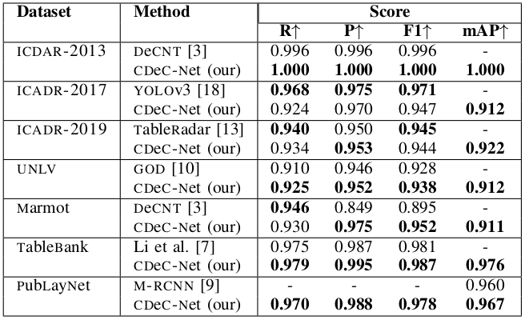

# CDeCNet
[](https://github.com/open-mmlab/mmdetection)


CDeC-Net: Composite Deformable CascadeNetwork for Table Detection in Document Images

## Introduction
CDeCNet is an end-to-end network for detecting tables in document images. The network consists of a multistage extension of Mask R-CNN with a dual backbone having deformable convolution for detecting tables varying in scale with high detection accuracy at higher IoU threshold. CDeCNet achieves state-of-the-art results on various publicly available benchmark datasets.
The code is implemented in PyTorch using <a href="https://github.com/open-mmlab/mmdetection">MMdetection</a> framework (Version 2.0.0). 


## Setup
<b>Dependencies</b><br>
PyTorch = 1.4.0<br>
Torchvision = 0.5.0<br>
Cuda = 10.0<br>
MMdetection = 2.0.0<br>
mmcv = 0.5.4<br>

Please follow <a href="https://github.com/mdv3101/CDeCNet/blob/master/docs/install.md">install.md</a> for detailed installation steps.

## Training
1. Create a folder 'dataset' in the CDeCNet and put your data into this folder. Your dataset must be in MS-Coco format. The directory structure should be:
```
dataset
  ├── coco
  | ├── annotations
  | ├── train2014
  | ├── val2014
  | ├── logs
```
2. Create a folder 'model' in the CDeCNet and put the pre-trained model on MS-Coco into this directory. The model file can be downloaded from the [google drive](https://drive.google.com/file/d/1JXt2F5pDJmSN5C7DXVKff93ksmMMqdcB/view?usp=sharing)

3. Set ```load_from= /path/of/pre-trained/model``` in [default_runtime.py](configs/_base_/default_runtime.py)
4. To train a model on CDeCNet, use the following commnand
```
python3 -u tools/train.py configs/dcn/db_cascade_mask_rcnn_x101_fpn_dconv_c3-c5_1x_coco.py --work-dir dataset/coco/logs/
```
<br>
Note that step 2 and 3 are optional. If you want to train a model from scratch, then you can skip these two steps. (Training a model from scratch will take larger time to converge)

## Evaluation
To evaluate the trained model, run the following command
```
python3 tools/test.py configs/dcn/db_cascade_mask_rcnn_x101_fpn_dconv_c3-c5_1x_coco.py dataset/coco/logs/latest.pth \
    --format-only --options "jsonfile_prefix=evaluation_result"
```
Details about various training and evaluation methods can be found in [getting_started.md](docs/getting_started.md)

## CDeCNet Results


## Issue
Kindly go through the various tutorails and documentation provided in [docs folder](docs). <br>
Most of the common issues were already solved in MMdetection official repo's [Issue Page](https://github.com/open-mmlab/mmdetection/issues). We strongly suggest to go through it before raising a new issue.
